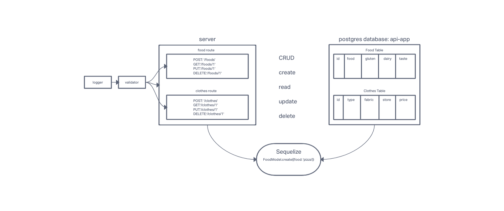

# LAB - Class 03

## Project: Basic API Server

### Author: KC Hofstetter

### Problem Domain

Build a REST API using Express, by creating a proper series of endpoints that perform CRUD operations on a database, using the REST standard

### Links and Resources

- [ci/cd](https://github.com/khofstetter94/basic-api-server/pull/1) (GitHub Actions)
- [back-end server url](https://kmh-basic-api-app.herokuapp.com/) (when applicable)

### Setup

- `PORT` - 3002

#### How to initialize/run your application (where applicable)

- npm start
- nodemon

#### Features / Routes

- POST: /foods or /clothes
  - Returns: The item that was added to the database.
- GET: /foods or /clothes
  - Produces JSON objects with keys 'abcd' and values 'entered abcd'
- PUT: /foods/1 or /clothes/1
  - Returns: The object from the database, which has the id matching that which is in the path, with the updated/changed data.
- DELETE: /foods/1 or /clothes/1
  - Returns: The record from the database as it exists after you delete it (i.e. null).

#### Tests

- 404 on a bad route
- 404 on a bad method
- The correct status codes and returned data for each REST route
  - Create a record using POST
  - Read a list of records using GET
  - Read a record using GET
  - Update a record using PUT
  - Destroy a record using DELETE

#### UML

